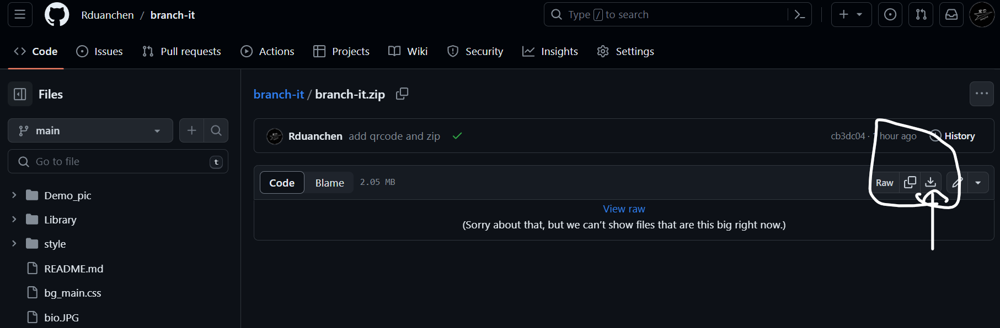
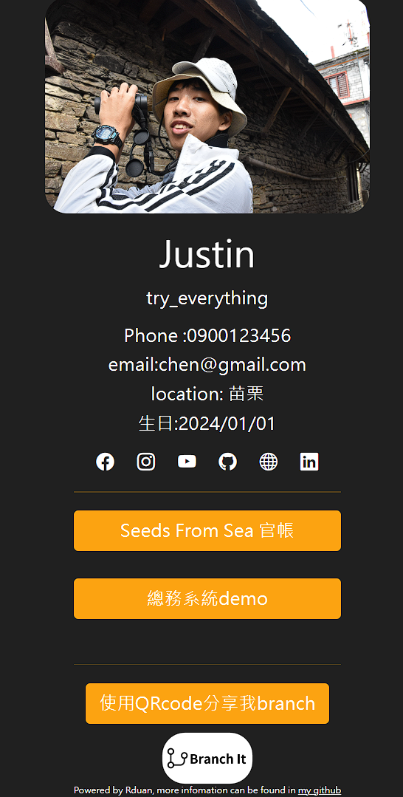
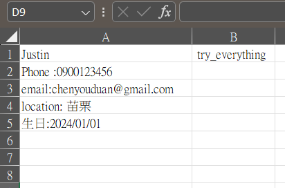
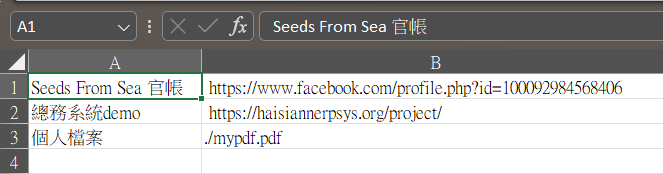
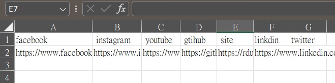

# Branh it
> 更簡單的製作個人名牌

### 產品特色
* 完全免費、可自由的調整程式碼
* 可呈現於Github Page
* 可以透過按鈕連結網站、pdf檔案
* 具有響應式設計，手機以及電腦皆可以使用
* 不需要具有程式基礎
* QRcode 分享功能

## ToDo Warnning:
* 此程式在手機的「QRcode」分享尚未完成，因此僅電腦版可以使用。

## 取得Branch It
您可以直接下載本專案所付的zip
[下載連結1](https://rduansharingpoint.site/branch-it/branch-it.zip)
[下載連結2](https://github.com/Rduanchen/branch-it/blob/main/branch-it.zip)


### [網站Demo](https://rduanchen.github.io/branch-it/)


# 如何自定義網站內容
> 下面這個章節將教大家如何透過CSV 檔案，來編輯站的內容

## 檔案結構介紹
在下載的檔案中，您可以找到以下幾個檔案
* userdata.csv
* index.csv
* social_media.csv
下面我會介紹這些檔案的用處以及如何編輯

## 如何開啟CSV檔案?
大部分的Excel、Numbers都可直接編輯，但是記得請使用純文字，不可以使用公式。
另外在編寫時，請遵照下面段落的格式，切勿自行改變格式，以免讀寫錯誤。

## userdata.csv 使用者資料區域

在`A1`這個表格中，請寫上這個名片的名稱，在`B2`可以寫下屬於您的標語
而第`2`行以後，則可以在`A`排上面編寫想要呈現的內容

## index.csv branch 的資訊

在`A`這個表格中，可以填入按鈕的名稱，而`B`則請填寫該按鈕的連結
如果您要放置`pdf`檔案或是`照片`，請使用`./+檔案名稱`，的方式

## social_media.csv 媒體檔案

您可以在這的檔案中放入您的社交媒體資訊，在`第一行`為社交媒體的名稱**請勿更動**，在第二行，請放入您的連結

## 設定個人圖片
您可以放入您的圖片為網站封面，但是目前僅限jpg檔案，並且請將檔案命名為`bio.JPG`，以免識別錯誤。

## 如何自訂義網站顏色
> 這個網站可以自訂義各個元件的顏色，如果您不熟悉CSS 的語法，您可套用已經設定好的文檔

您可以找到一個為`bg_main.css`的檔案，您可以直接修正這個檔案，或是將這個檔案覆蓋掉即可，請直接
```css

/* 背景顏色，直接使用色票即可*/
body{
    background-color: #202020; /* 固色背景 */
    /* background-image: linear-gradient(to right, #caf0f8, #00b4d8); */ /* 漸層背景 */
}
/* 字體顏色 */
.self-text{
    color: #fff;
}
/* 個人介紹內容行距 */
.bio{
    line-height:10px
}

/* 按鈕顏色 */
.btn-primary, .btn-primary:hover, .btn-primary:active, .btn-primary:visited {
    background-color: #fca311 !important;
    outline-color: #fca311 !important;;
    border: none;
}

/* 社群圖標、按鈕文字顏色 */
a{
    color: #fff;
}

/* 商標文字顏色 */
footer{
    color: #fff;
}

/* 水平線顏色 */
hr{
    background-color: #fca311;
}
```


> 做完以上的流程之後，基本上網站就可以正常運作，如果你有自己的伺服器，做到這一步就可以囉

如果沒有自己的伺服器，就要使用以下的步驟，來部屬到Github Page


## 部屬到GithubPage
步驟摘要:
1. 申請Github 帳號
2. 上傳檔案
3. 部屬Github Page


# 官方樣式列表:
亮藍色版本
```css
body{
    background-color: #f1faee;
    background-image: linear-gradient(to right, #f1faee, #a8dadc);
}
.self-text{
    color: #1d3557;
}
.bio{
    line-height:10px
}

.btn-primary, .btn-primary:hover, .btn-primary:active, .btn-primary:visited {
    background-color: #457b9d !important;
    border: none;
}

a{
    color: #e63946;
}

hr{
    background-color: #e63946;
}
```
